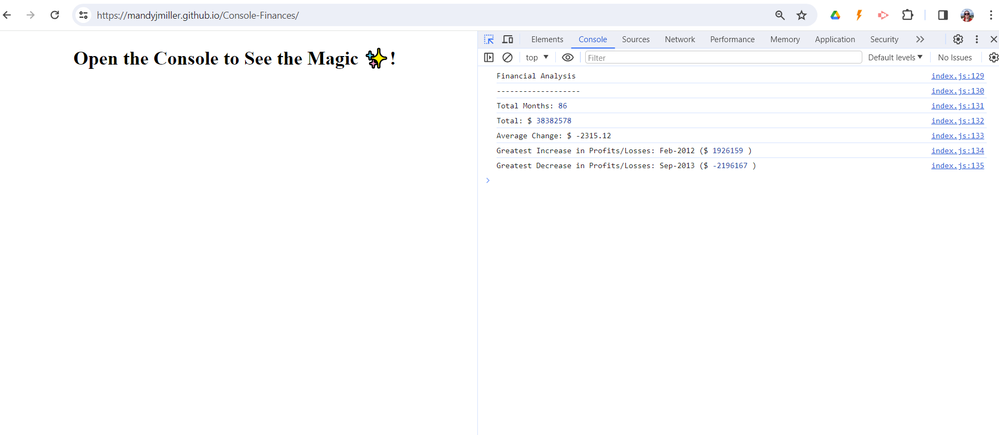

#  Unit 4 Challenge: Javascript Console-Finances

## User Story

As a developer, I've been tasked with creating JavaSript code for analyzing the financial records of a company

## Acceptance Criteria

I will have met the brief when the following acceptance criteria are met:

JavaScript code that analyzes the records to calculate each of the following:

* The total number of months included in the dataset.

* The net total amount of Profit/Losses over the entire period.

* The average of the **changes** in Profit/Losses over the entire period.
  * I need to track what the total change in Profit/Losses are from month to month and then find the average.
  * (`Total/(Number of months - 1)`)

* The greatest increase in Profit/Losses (date and difference in the amounts) over the entire period.

* The greatest decrease in Profit/Losses (date and difference in the amounts) over the entire period.

## Installation

No particular installation requirements. Web page can be viewed using Chrome, Firefox, Safari or most other standard browser, using "Inspect" Console to see the output 

## Usage 

This site can be accessed on GitPages [HERE](https://mandyjmiller.github.io/Console-Finances/)

Screenshot of the site can be seen here:

## Credits

Shout out to the teaching team at EdX and fellow students for help and collaboration.

Tutorials and base materials from  [Module 4 Challenge](https://bootcampspot.instructure.com/courses/5651/assignments/67060)

## License

MIT License

Copyright (c) 2023 Mandy Miller

Permission is hereby granted, free of charge, to any person obtaining a copy
of this software and associated documentation files (the "Software"), to deal
in the Software without restriction, including without limitation the rights
to use, copy, modify, merge, publish, distribute, sublicense, and/or sell
copies of the Software, and to permit persons to whom the Software is
furnished to do so, subject to the following conditions:

The above copyright notice and this permission notice shall be included in all
copies or substantial portions of the Software.

THE SOFTWARE IS PROVIDED "AS IS", WITHOUT WARRANTY OF ANY KIND, EXPRESS OR
IMPLIED, INCLUDING BUT NOT LIMITED TO THE WARRANTIES OF MERCHANTABILITY,
FITNESS FOR A PARTICULAR PURPOSE AND NONINFRINGEMENT. IN NO EVENT SHALL THE
AUTHORS OR COPYRIGHT HOLDERS BE LIABLE FOR ANY CLAIM, DAMAGES OR OTHER
LIABILITY, WHETHER IN AN ACTION OF CONTRACT, TORT OR OTHERWISE, ARISING FROM,
OUT OF OR IN CONNECTION WITH THE SOFTWARE OR THE USE OR OTHER DEALINGS IN THE
SOFTWARE.

---

© 2023 edX Boot Camps LLC. Confidential and Proprietary. All Rights Reserved.
